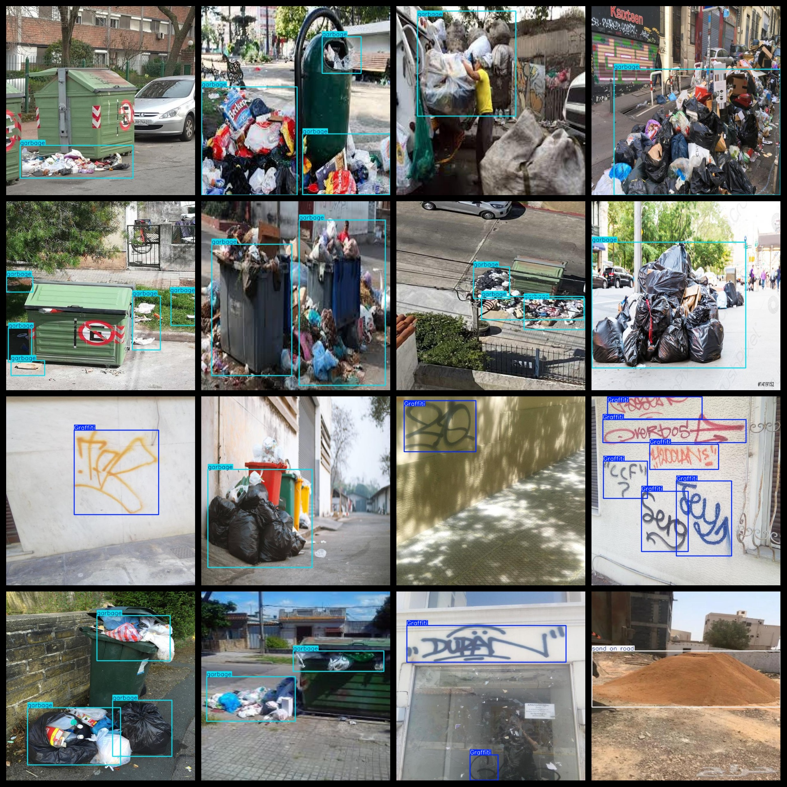
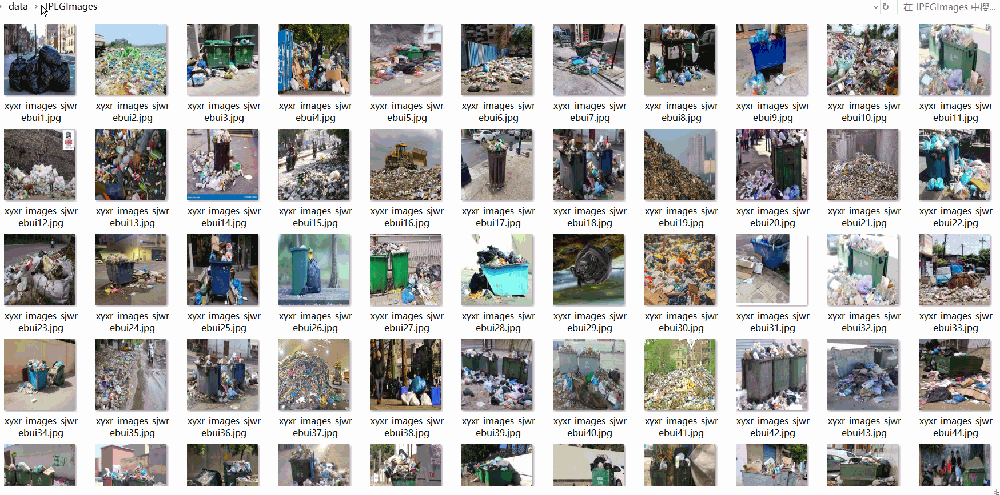

# Smart City Street WordPress Environment City Appearance Inspection Dataset 2255 imagesVOC+YOLO format

The Smart City Street environment inspection dataset is composed of 2255 images in the VOC+YOLO format.

The dataset is organized according to the Pascal VOC format and the YOLO format without including a text file for splitting, only containing JPG images along with their corresponding VOC format XML files and YOLO format text files.

Number of images (JPG files): 2255

Number of annotations (XML files): 2255

Number of annotations (text files): 2255

Number of annotation categories: 3

Repository location: datasets_sl

Annotation category names in the labelImg format are as follows: ["Graffiti", "garbage", "sand on road"]

Box counts per category:

- Graffiti boxes = 1724
- Garbage boxes = 2842
- Sand on road boxes = 97

Total box count: 4663

Images per category:

- Graffiti images = 1045
- Garbage images = 1122
- Sand on road images = 88

Image resolution: 640x640

Annotation tool used: labelImg

Dataset enhancement status: No

Annotation rules: Draw bounding boxes for each category

Important note: The dataset does not have been split into training, validation, and testing sets; it should be split by the user.

Special declaration: This dataset does not guarantee any accuracy for the trained models or weight files.

Annotation and image situation as follows:

## Images

---

Here is a pay link on Stripe (https://buy.stripe.com/3cs8yP7sY87d0vu9AB). Please contact me lonlonago@foxmail.com after funding $89, and I will send you a complete data files, thank you!

